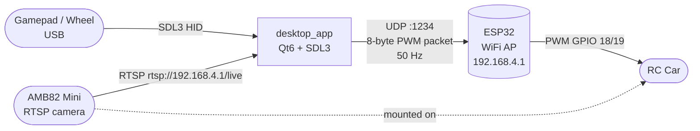
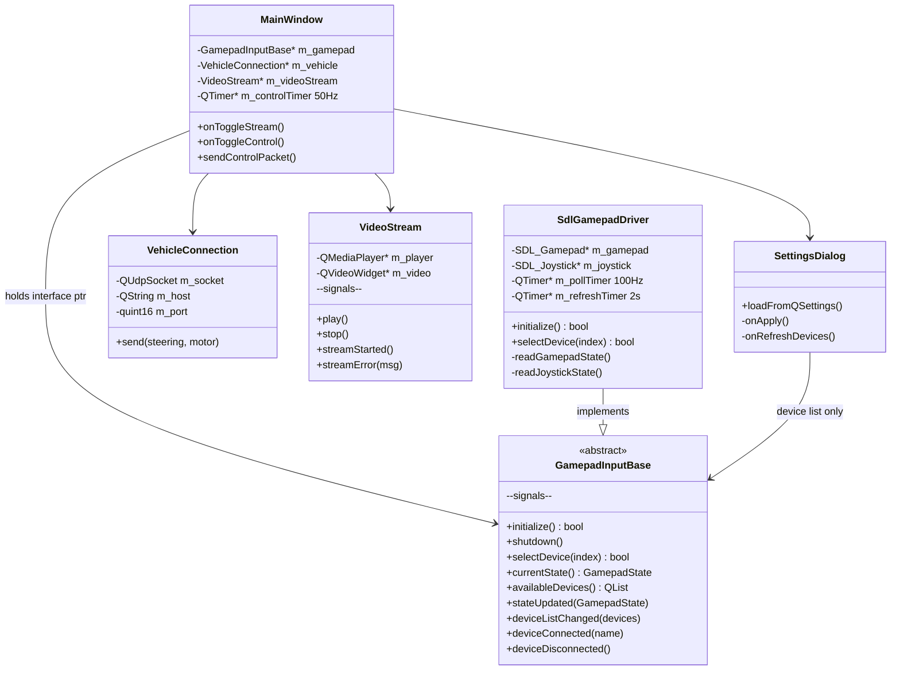
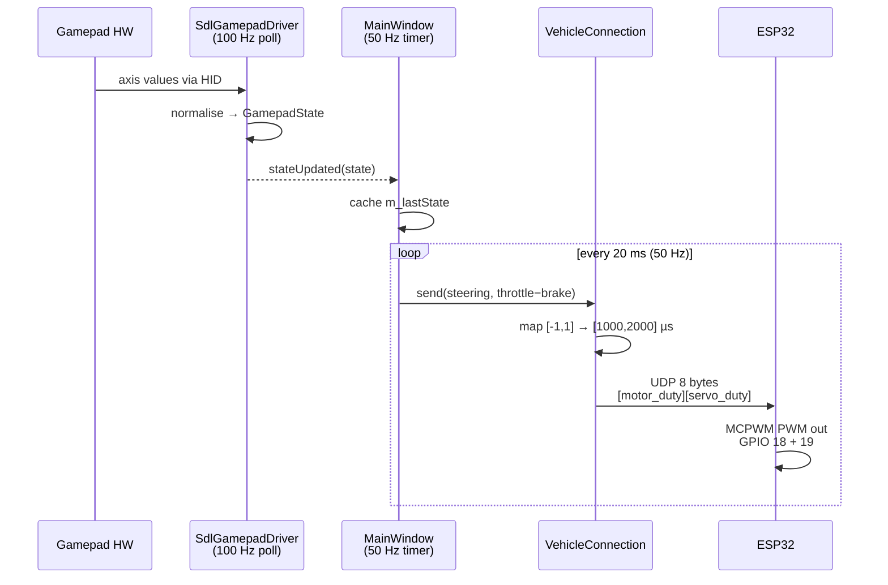
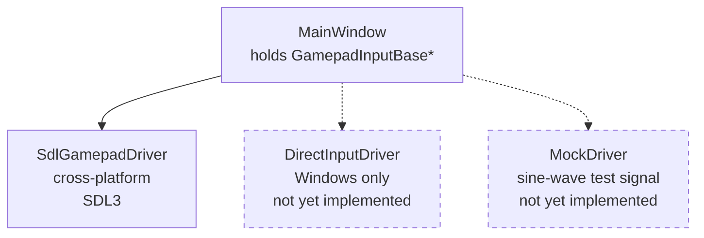
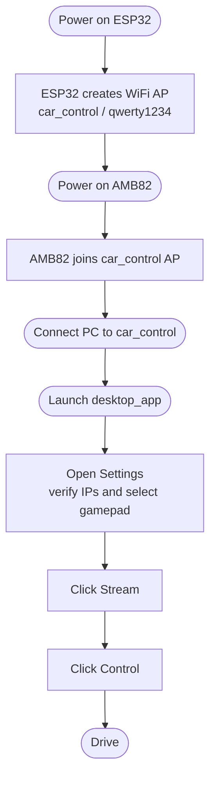
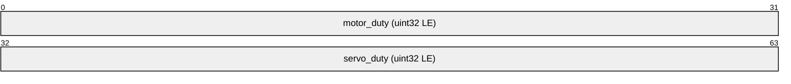

# desktop_app

Main entry point and orchestrator for the RC FPV car system.

Reads steering input from a gamepad or racing wheel, forwards it to the ESP32 controller over UDP, and displays the FPV video stream from the AMB82 camera.

---

## System overview



---

## Architecture



---

## Data flow



---

## Driver interface

Adding a new input backend only touches two things: a new class and one line in `mainwindow.cpp`.



---

## File structure

```
desktop_app/
├── src/
│   ├── main.cpp                  Entry point
│   ├── mainwindow.h/cpp          Top-level window — toolbar, video, status bar
│   ├── settingsdialog.h/cpp      Settings: RTSP URL, ESP32 IP/port, device picker
│   └── gamepad/
│       └── SdlGamepadDriver.cpp  SDL3 concrete gamepad/wheel driver
├── include/
│   └── gamepad/
│       ├── GamepadInputBase.h    Abstract driver interface (no SDL dependency)
│       └── SdlGamepadDriver.h
└── CMakeLists.txt
```

---

## Dependencies

| Dependency | Purpose | How to get |
|------------|---------|------------|
| Qt 6 (Core, Widgets, Network, Multimedia, MultimediaWidgets) | UI + video + UDP | See below |
| SDL3 | Gamepad / wheel input | See below — auto-downloaded if missing |

### macOS

```bash
brew install qt6 sdl3
```

### Windows (MinGW)

- Qt6: download from [qt.io](https://www.qt.io/download-qt-installer) or `winget install qt`
- SDL3: extract `SDL3-devel-3.4.4-mingw.zip` (included in this folder) to a known path, then pass `-DSDL3_DIR=<path>/cmake` to CMake. Alternatively, CMake will auto-download SDL3 via FetchContent if SDL3 is not found.

---

## Build

```bash
cd desktop_app
mkdir build && cd build

# macOS
cmake .. -DCMAKE_PREFIX_PATH="$(brew --prefix qt6)"

# Windows (MinGW, Qt installed to C:\Qt\6.x.x\mingw_64)
# cmake .. -DCMAKE_PREFIX_PATH="C:/Qt/6.x.x/mingw_64"

make -j$(nproc)        # Linux / macOS
# mingw32-make         # Windows MinGW
```

The first build fetches and compiles SDL3 from GitHub if it was not found locally — this takes a few extra minutes.

---

## First run



Default addresses (set in Settings):
- RTSP URL: `rtsp://192.168.4.1/live`
- ESP32 IP: `192.168.4.1`, Port: `1234`

---

## Gamepad / wheel support

SDL3 recognises most modern gamepads automatically (Xbox, PlayStation, Switch Pro, and many racing wheels). The driver tries the standard **gamepad** mapping first:

| Axis | Control |
|------|---------|
| Left stick X | Steering |
| Right trigger | Throttle |
| Left trigger | Brake |

If the device is not in SDL's database it falls back to **raw joystick** mode:

| SDL axis index | Control |
|----------------|---------|
| 0 | Steering |
| 1 | Throttle (auto-inverted) |
| 2 | Brake (auto-inverted) |

To add a new driver backend, implement `GamepadInputBase` and replace `new SdlGamepadDriver(this)` in `mainwindow.cpp`.

---

## Control packet format



8 bytes, little-endian, sent over UDP to the ESP32:

```
bytes 0–3 : uint32_t  motor_duty   (1000–2000 µs PWM)
bytes 4–7 : uint32_t  servo_duty   (1000–2000 µs PWM)
```

Neutral position is 1500 µs for both channels. Packets are sent at 50 Hz when **Control** is active. The ESP32 resets to neutral after 1 second without a packet.
