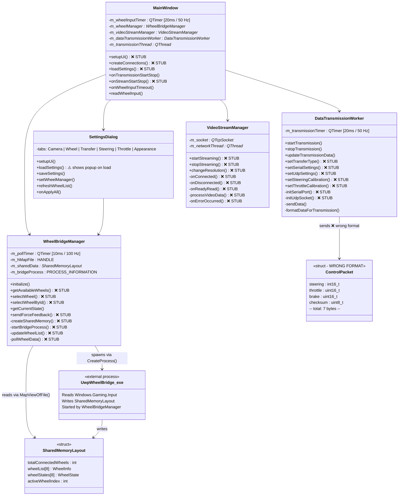
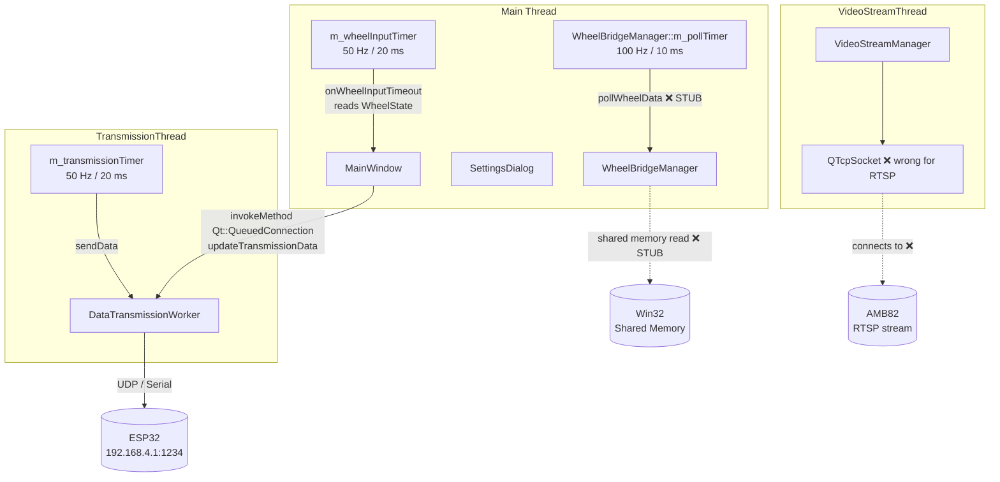
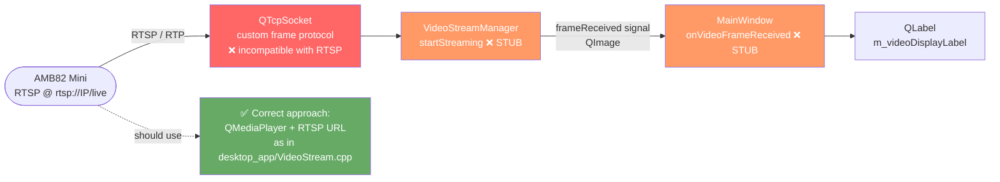
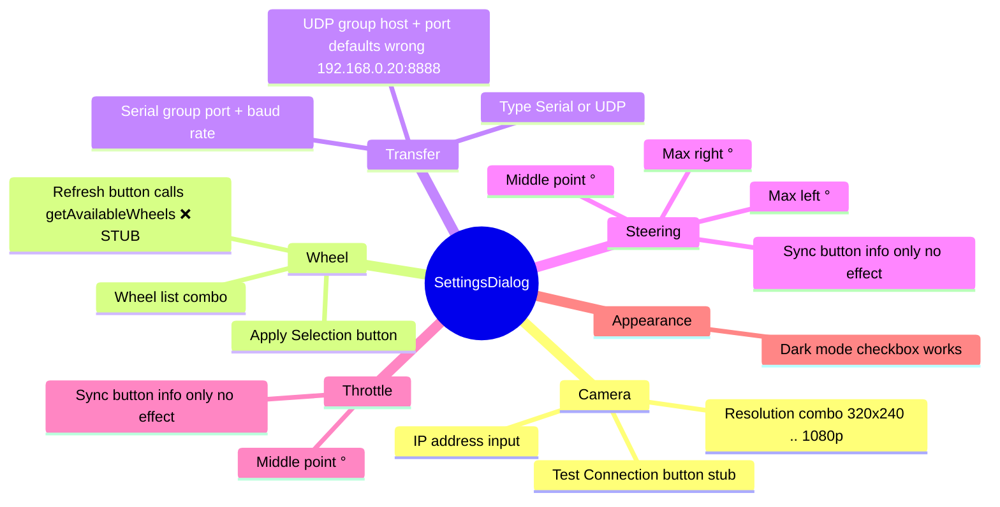
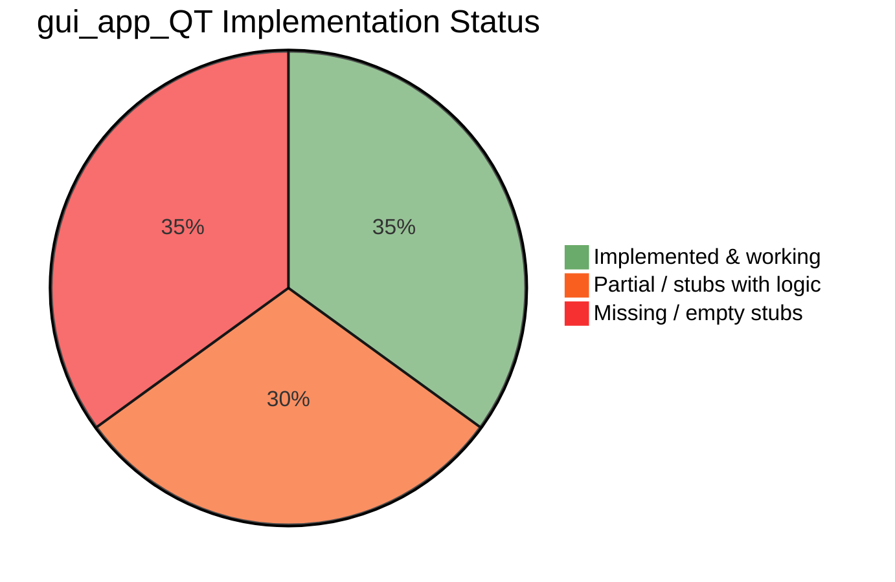

# gui_app_QT — Architecture & Current Operational Scope

> **Status:** Skeleton / partially implemented. Many methods are stubs ("omitted for brevity").  
> Windows-only (WinRT, Win32 shared memory, DirectInput).

---

## 1. Class Relationships



---

## 2. Thread Architecture



---

## 3. Wheel Input Data Flow

```mermaid
flowchart LR
    HW([Racing Wheel\nHardware])
    UWP[UwpWheelBridge.exe\nWindows.Gaming.Input\n❌ separate VS project]
    SHM[(Win32\nNamed Shared Memory\nSharedMemoryLayout)]
    WBM[WheelBridgeManager\npollWheelData ❌ STUB\n100 Hz poll]
    MW[MainWindow\nreadWheelInput\n50 Hz timer]
    DTW[DataTransmissionWorker\nsendData\n50 Hz timer]
    ESP[(ESP32\nUDP :1234)]

    HW -->|HID / USB| UWP
    UWP -->|writes| SHM
    SHM -->|reads via MapViewOfFile ❌ STUB| WBM
    WBM -->|wheelDataUpdated signal\nWheelState| MW
    MW -->|updateTransmissionData\nTransmissionData| DTW
    DTW -->|ControlPacket 7B ❌\nshould be 2×uint32 8B| ESP

    style UWP fill:#f66,color:#fff
    style WBM fill:#f96,color:#fff
    style DTW fill:#f96,color:#fff
    style ESP fill:#fc6,color:#000
```



---

## 4. Video Stream Flow



---

## 5. UDP Protocol Mismatch

```mermaid
flowchart TB
    subgraph App sends — ControlPacket 7 bytes ❌
        direction LR
        A1[int16_t steering\n2 B]
        A2[uint16_t throttle\n2 B]
        A3[uint16_t brake\n2 B]
        A4[uint8_t checksum\n1 B]
    end

    subgraph ESP32 expects — 8 bytes ✅
        direction LR
        B1[uint32_t motor_duty\n4 B\n1000–2000 µs]
        B2[uint32_t servo_duty\n4 B\n1000–2000 µs]
    end

    subgraph ESP32 validation
        V1{len == 8?}
        V2{servo 1000–2000?}
        V3[Accept & apply PWM]
        V4[Drop packet]
    end

    App -->|sends 7 B to 192.168.0.20:8888 ❌\nshould be 192.168.4.1:1234| ESP32_recv

    ESP32_recv --> V1
    V1 -->|No — 7 ≠ 8| V4
    V1 -->|Yes| V2
    V2 -->|out of range| V4
    V2 -->|ok| V3

    style V4 fill:#f66,color:#fff
    style V3 fill:#6a6,color:#fff
```

---

## 6. Settings Dialog — Tab Map



---

## 7. Implementation Status Summary



| Component | Status | Blocker |
|-----------|--------|---------|
| `mainwindow.cpp` — layout & buttons | ⚠️ Partial | `setupUi()` stub |
| `mainwindow.cpp` — wheel timer loop | ✅ Done | — |
| `mainwindow.cpp` — stream/transmission UI | ❌ Missing | `onVideoFrameReceived`, `onStreamStatusChanged` etc. stubs |
| `wheelbridgemanager.cpp` — process spawn | ❌ Missing | `startBridgeProcess()` stub |
| `wheelbridgemanager.cpp` — shared memory | ❌ Missing | `createSharedMemory()` stub |
| `wheelbridgemanager.cpp` — poll loop | ❌ Missing | `pollWheelData()` stub |
| `datatransmissionworker.cpp` — UDP send | ⚠️ Partial | `initUdpSocket()` stub |
| `datatransmissionworker.cpp` — serial send | ⚠️ Partial | `initSerialPort()` stub |
| `datatransmissionworker.cpp` — packet format | ❌ Wrong | 7 B sent, 8 B expected |
| `videostreammanager.cpp` — all methods | ❌ Missing | Entire implementation missing |
| `videostreammanager` — protocol | ❌ Wrong | TCP custom frames ≠ RTSP |
| `settingsdialog.cpp` | ✅ Mostly done | Minor UX issues |
| UDP target address | ❌ Wrong | `192.168.0.20:8888` → should be `192.168.4.1:1234` |
| UWP bridge `.exe` | ❌ Missing binary | Must be built separately in VS |
